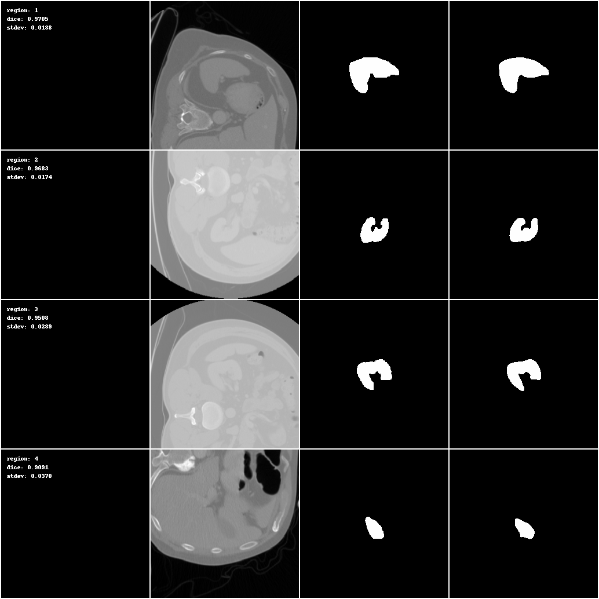

# test

```bash
# Train a 2D Deepgrow model on multi-gpu
python -m torch.distributed.launch \
    --nproc_per_node=`nvidia-smi -L | wc -l` \
    --nnodes=1 \
    --node_rank=0 \
    --master_addr="localhost" \
    --master_port=1234 \
    -m train \
    --multi_gpu true \
    --input       deepgrow/2D/MSD_Task09_Spleen/dataset.json \
    --output      models/2D \
    --epochs      50
```

#### [Deepgrow Handler](./handler.py)
It contains basic ignite handler to capture region/organ-wise statistics, save snapshots, outputs while running train/validation over a dataset that has multi-label mask.
By-default the handler is added as part of training/validation steps.


